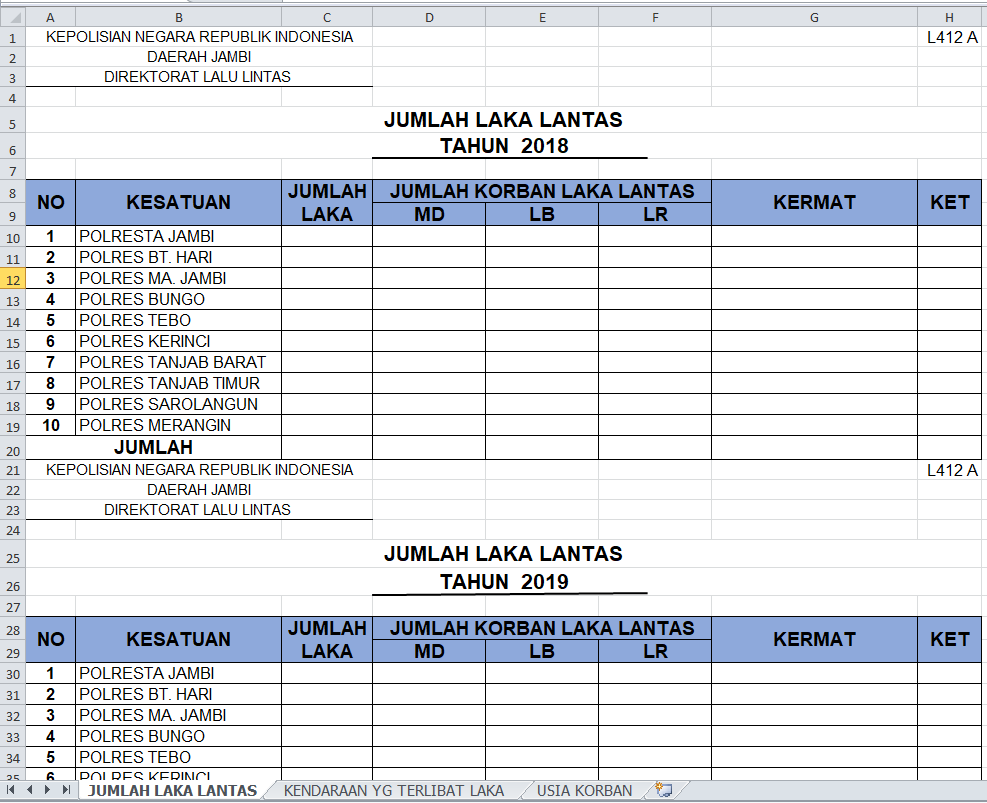
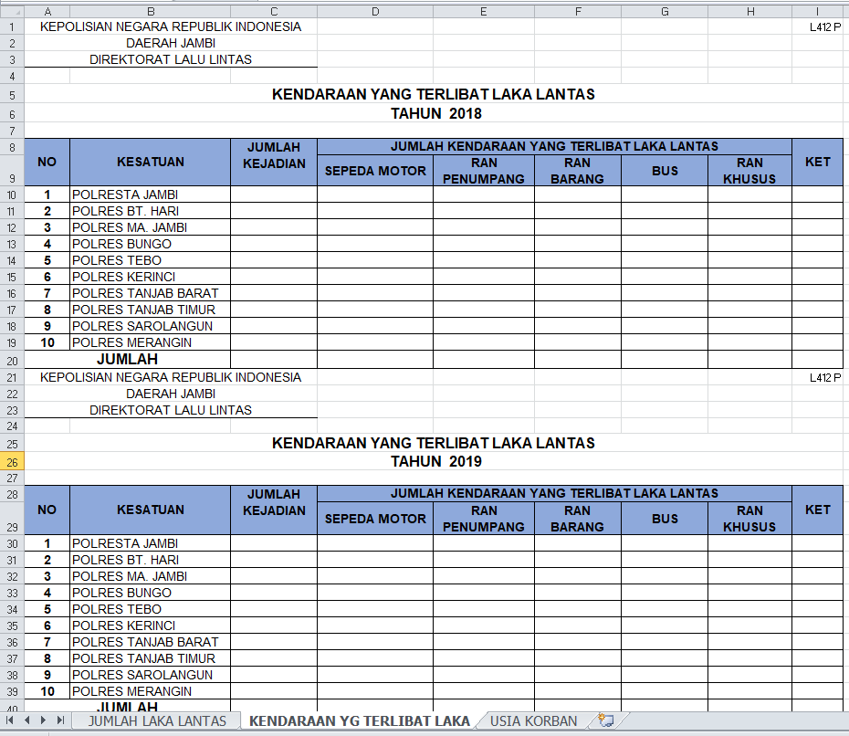
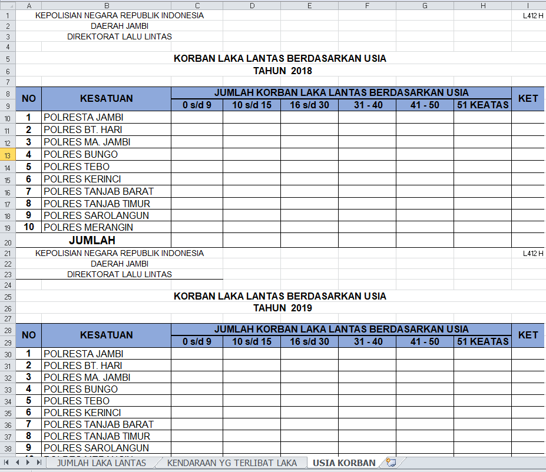
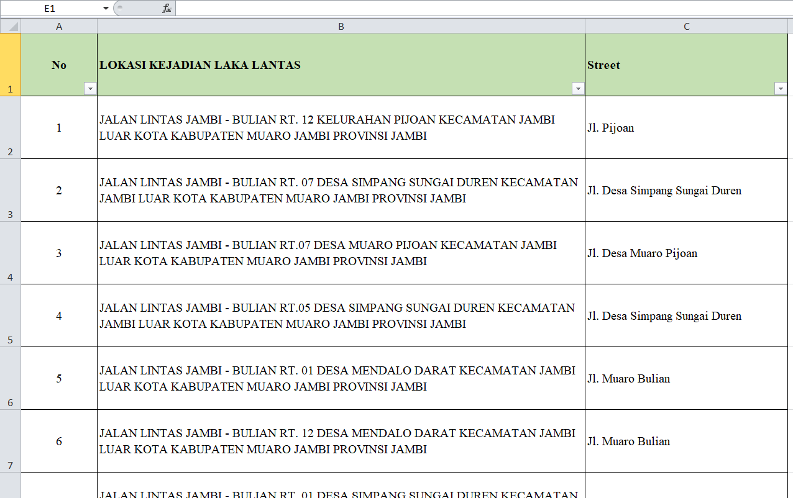

# Traffic Accident With K Means Clustering
This repository is used to my thesis as a student from Informatic Engineer at Sriwijaya University. The data took from Polda Jambi.

# Technologies (Library)
* `streamlit`
* `pandas`
* `scikit-learn`
* `numpy`
* `io`

# Dataset
The dataset used is in xlsx format. For the dataset table as below:
## Dataset 1 (Klasterisasi Data Kecelakaan)

### Sheet 1: Jumlah laka lantas

### Sheet 2 : Kendaraan yang terlibat laka

### Sheet 3 : Usia Korban

## Dataset 2 (Klasterisasi Lokasi Kejadian)

# Features
Here's what you can do:
* Upload dataset.
* Select the number of clusters 1 to 7.
* Clustering the dataset using k-means method.
* Cluster results displayed in scatter-plot graph.
* Testing cluster values with DBI to determine the optimal number of clusters.

# Running The Project
To running this code, you can type : `streamlit run mainWindow.py` in your command prompt / terminal.

